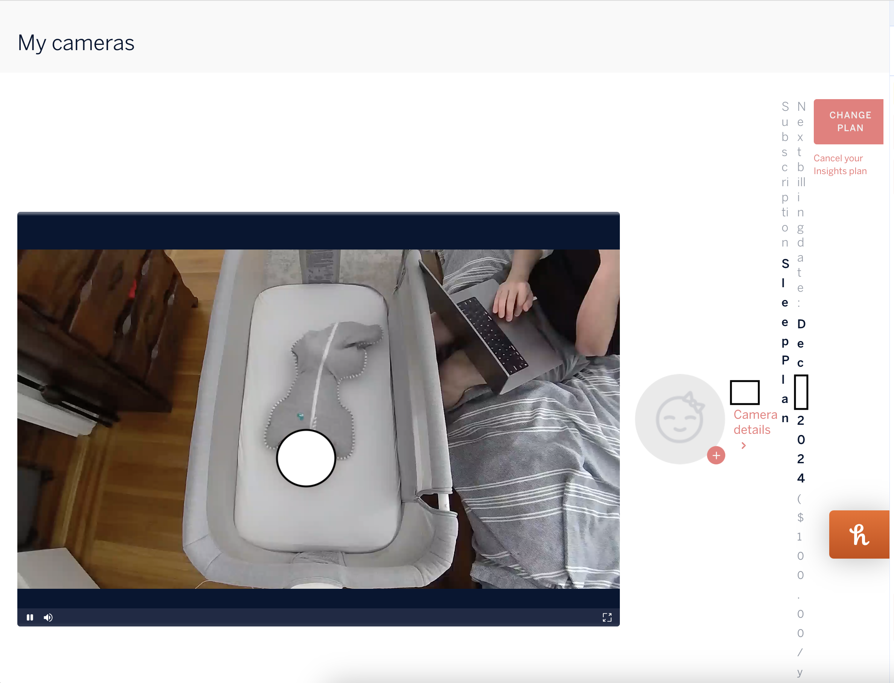

# Nanit Baby Monitor Webcam Enlarger
This copy-paste browser script will expand the Nanit baby monitor webcam live stream video on their [web app](https://my.nanit.com), allowing you to watch it in 800x550px, instead of either tiny or full screen. This way you can watch it on your computer while multitasking.  You can run this in the console of your browser, or use a browser extension like Tampermonkey to run it automatically.

Steps:
1. Open the Nanit web app: https://my.nanit.com
2. Open the Console in your [browser's Developer Tools](https://balsamiq.com/support/faqs/browserconsole) (Chrome: Option + ⌘ + J (Mac) or Shift + CTRL + J (Windows))
3. Copy paste the contents of the [nanit-cam-expander.js script](nanit-cam-expander.js) in the console, and press Enter/return to run it
4. Done!

# Example

